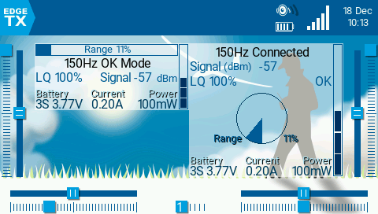

### No, you can't use this widget to configure your TX module, don't ask!

A simple widget to display ExpressLRS LinkStats telemetry as well as common Betaflight and iNav flight controller telemetry.

# Installing
* Copy the `src/WIDGETS/ELRST` folder to your handset's SD card in the `WIDGETS/` folder such that your SD card will end up with a file called `WIDGETS/ELRST/main.lua`.
* Discover sensors
  * Power up your receiver and flight controller and wait for a connection to be established.
  * Press the MDL (model) key, then PAGE to get to the TELEMETRY page.
  * Use the "Discover new" button to start discovering sensors. Betaflight should have 17, iNav should have 23 with GPS.
* Add the widget to the main screen
  * Press the TELEM button on the handset and navigate to the second page.
  * Tap "Setup widgets".
  * Tap an open space and add the "ELRS Telem" widget.
  * Use the RTN / EXIT button to go back until you're on the main screen again.
  * If you forgot to Discover sensors before adding the widget, discover them and restart the handset entirely.

## Requirements
* Tested on Radiomaster TX16S with EdgeTX 2.5 only

## What is "Range"?
Range is an estimation of the model's distance. Technically, it is just the percentage of the RSSI from -50dBm (0% range) to the sensitivity limit for your selected packet rate (e.g. -105dBm for 500Hz) where it would indicate 100% range. Range does not account for dynamic power, so the indicated range may decrease as power goes up and increase as power goes down.

## Can the last GPS coordinates be added?
When an RX disconnects, OpenTX/EdgeTX no longer returns the "last known" values, it just returns 0. I could save the last value on every update to make it available, but this is better handled by just adding a "Value" type widget with the GPS item on it, which will keep the last known value even on disconnect. The GPS speed, altitude and satellite count are shown on the fullscreen layout of this widget though.